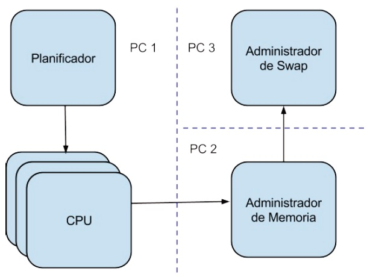

Cache13
======

Micro Sistema Operativo
-----------------
Cache 13 es un pequeño sistema que emulará el funcionamiento de algunos módulos del Sistema Operativo. El mismo
permitirá ejecutar algunos programas a los que llamaremos “mCod”, compuestos de sentencias sencillas. Estos programas
en ejecución serán denominados procesos “mProc”. El orden en el cual se ejecutarán estará determinado por un
planificador de corto plazo que, basándose en diferentes algoritmos, seleccionará el siguiente proceso a ejecutar.

La ejecución de estas sentencias requerirá diferentes accesos a memoria, tales como lecturas, escrituras, inicialización y
finalización. Estos accesos serán realizados utilizando un administrador de memoria.

Esta simulación tiene por objetivo profundizar en los conceptos relacionados a la planificación de procesos y a la
utilización de memoria virtual en un Sistema Operativo tradicional, implementado con paginación por demanda. Por ende,
algunos de los accesos a memoria, requerirán también accesos a una partición de swap.

ARQUITECTURA:
-----------------

PROCESO DESARROLLADO:
-----------------
ADMINISTRADOR DE MEMORIA

- Desarrollo de la interfaz de comunicacion con N CPU's y SWAP (Por Sockets).
- Utilizacion de Hilos e Hijos en el desarrollo.
- Implementacion de Algoritmos de reemplazo de pagina: FIFO, LRU y Clock Modificado.
- Implementacion de Sistema de Gestion de Memoria Virtual.
- Codigo escrito emulando el patron de diseno MVC.
- Creacion dinamica de estructuras administrativas.
- Emulacion de dispositivos fisicos tales como Memoria RAM y TLB.
- Manejo de senales del SO, metricas sincronicas, persistencia de eventos en archivos de log y volcados de memoria.